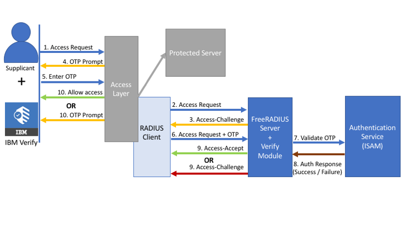

# IBM Verify - FreeRadius module
IBM Verify FreeRadius module for enhanced authentication.

## Quick start
To use this repository, you must have already setup SSH keys to the IBM Github. See a guide [here](https://help.github.com/articles/adding-a-new-ssh-key-to-your-github-account/). 
You must also already have either Vagrant or Docker & Docker Compose installed. 
```
git clone git@github.ibm.com:jaredpa/IBM-Verify-FreeRADIUS.git
cd Verify-FreeRadius/
```
For normal production usage: 
```
docker-compose up -d
```
or if you want a development environment (See [Building from Source](#building-from-source) for more info):
```
vagrant up
```
If you want to use the module for an existing installation of FreeRadius - skip to [Existing installation setup](#existing-installation-setup).

### Verification testing
The easiest way to test the environment is to use the provided test client script. Run through the [Shell Test Client](#shell-test-client) section and verify that the setup in the mode you have selected works.

## Architecture
The module is designed to be used in an environment similar to the following:


## Configuration
Property Name | Type | Description | Default
------------ | ------------- | ------------- | -------------
mode | String | The mode of operation of the Verify FreeRadius module | simple
protocol | String | The protocol through which the module will communicate with ISAM | https
server | String | The hostname of the ISAM. | ""
port | Integer | The port that the module will used for communication. | 443
junction | String | The junction through which the AAC policy is contained. This will be appended after the `hostname:port` | /mga
resource |String | The PolicyID of the ISAM Radius Authentication Policy | ""
apikey | String | The API key used to authenticate the Radius Client to ISAM. | ""
client | IP Address | The clients IP address. | 0.0.0.0
simple-format | String | For simple mode, the format of the OTP entry. | ""
otp-length | Integer | The length of the OTP | 6
otp-retry | Integer | The number of times a OTP can be tried | 5
reply-message | String | The string to return on a `Access-Challenge` or `Access-Reject` response. If on the Policy JSON response, a JSON property called `reply_message` is defined, then this will be used instead of this configuration parameter. | This is an ISAM OTP challenge. Please enter your OTP.
user-suffix | String | The suffix that will be appeneded to the username on each usage.  | ""
enabled | String/Boolean | If the module is enabled. | false
debug | String/Boolean | Enable debug trace. This will help in initial configuration. | false

### Example Configuration Stanza
The following is an example configuration stanza with all the configuration parameters used:
```
verify {
	mode = "multi",
	junction = "/mga",
	protocol = "https",
	server = "verify.securitypoc.com",
	port = 443,
	resource = "urn:ibm:security:authentication:asf:totp_validate",
	apikey = "YXBpLWNsaWVudDpwYXNzdzByZA==",
	client = 192.168.1.1,
	simple-format = "%PASS%:%OTP%",
	otp-length = 6,
	user-suffix = "@au1.ibm.com",
	enabled = "yes",
	debug = "yes",
	reply-message = "MY CUSTOM TEST MESSAGE"
}
```

## Modes

This module will support 3 modes (configurable via the [radiusd.conf](configuration/radiusd.conf) file) that will determine the functionality for an end user. 
The module **cannot** do all these 3 modes at once, however multi can be aliased to be very similar to simple. In addition, some Radius client programs do not support the
ability to handle the radius 'Accept-Challenge' response and present information to the user appropriately. This is not a limitation of this module but rather the client. 

### 1) Simple
A user will provide their username, password and OTP combination as a single field like:

```
username: testuser
password: passw0rd123456
```

Where the last 4-6 characters is the OTP. If the OTP is correct, then a `Access-Accept` packet will be issued, otherwise a `Access-Reject` packet will be issued.

### 2) Multi
A user will provide their username, password and OTP combination on prompt. An example of this is:

```
username: testuser
password: passw0rd
otp: 123456
```

This could change if there was no OTP required (by CBA policy for example). If the OTP is correct, then a `Access-Accept` packet will be issued. If the user does not provide the `otp` field in the initial request, or the OTP is wrong, then a `Access-Challenge` packet will be sent back. An `Access-Reject` packet will be sent if an error occurs in the response indicating the user hadn't registered for TOTP, the Radius Authentication was incorrect, the user wasn't found or some other internal platform error.

### 3) Interactive (Under Development)
A user will provide their username, password and select from modes of authentication:

```
username: testuser
password: passw0rd

1. SMS
2. TOTP
3. Verify

verify

Waiting for you to approve on your linked device...
```

This flow allows a user to select HOW they would like to present their second factor of authentication. 

## Shell Test Client
The easiest way to test the Verify Radius module is to use the provided test script. This test script is a shell script that utilises `radclient` to make the appropriate calls for the different modes of the module. It assists in maintaining the Radius `State` parameter and challenging appropriately for the OTP when a `Access-Challenge` packet is recieved. 
```
~/Verify-FreeRadius $ sh test_verify_radius.sh
usage: test_verify_radius.sh <mode> <host> <port> <secret> <user> <otp:OPTIONAL>
```
Example usage:
```
sh test_verify_radius.sh multi localhost 1812 example_verify_secret username@address.com
```

## Building from Source

You may use [Vagrant](https://www.vagrantup.com/) to build your development environment as the [Quick Start](#quick-start) section details, or use the following instructions to construct your own development environment.

1. Download necessary compilation packages
The [Vagrantfile](Vagrantfile) essentially shows you exactly what you need to do to set up the development environment. 
In the `Vagrantfile`, if you look at the two scripts `ubuntu_script` and `centos_script` you will see what packages you need for development and compilation of FreeRadius and the module through the two different package managers `APT` and `YUM`. 

To install required `YUM` packages:
```
yum update -y
yum install gcc openssl-devel.x86_64 git libtalloc-devel libcurl-devel -y
```

2. Download FreeRadius release source code
You can download the FreeRadius source page from the [Official GitHub Respository](https://github.com/FreeRADIUS/freeradius-server/releases). Choose your version carefully, the module supports version 3.0.4 and upward until 3.0.15 which is the current release at the time of publishing. 
The module also supports version 4.0 of FreeRadius - which is a significant change from version 3.X. To get this version of FreeRadius - you'll need to run:
```
git clone https://github.com/FreeRADIUS/freeradius-server.git
```
instead of downloading a package file. 

3. Make sure you can build the release from source
Unzip the folder and run:
```
cd freeradius-server/
./configure
make clean
make
make install
```
Ensure the commands succeed.

4. Compile with the Verify module included
Copy the `rlm_verify` folder from this [respository](src/rlm_verify) into the `freeradius-server/src/modules/` folder.
Run the following make commands again:
```
cd freeradius-server/
make clean
make
make install
```
Ensure the commands succeed.

### Development flow
Once you have a valid Vagrant environment, the following commands can be useful:

* Copy the binary out of the vagrant box:
`cp /home/vagrant/freeradius-server/build/lib/local/.libs/rlm_verify.so /vagrant/output/rlm_verify.so`

* Copy the source from your local machine into the vagrant box::
`cp /vagrant/src/rlm_verify/rlm_verify.c /home/vagrant/freeradius-server/src/modules/rlm_verify/rlm_verify.c`

* Make FreeRadius and run it
`cd freeradius-server/; sudo make clean; sudo make; sudo make install; radiusd -X`

#### Important file locations:
* Radius Configuration:
`/usr/local/etc/raddb/radiusd.conf`
* Clients Configuration:
`/usr/local/etc/raddb/clients.conf`
* Sites Available
`/usr/local/etc/raddb/sites-available/default`

## Docker setup
The docker setup is very similar to the [Existing installation setup](#existing-installation-setup) section. The [Dockerfile](Dockerfile) simply copies the binary file produced from the section [Building from Source](#building-from-source) and the two configuration files; [radiusd.conf](configuration/radiusd.conf) and [clients.conf](configuration/clients.conf). Notice the version of FreeRadius obtained from the Docker build is from the RedHat repositories - you may need to change this if you want a different version. 

## Existing installation setup
This section is for those who have an existing FreeRADIUS installation and want to use the Verify FreeRadius module. 
### Install
1. Stop your FreeRADIUS server. 
2. Copy the provided [rlm_verify.so](output/rlm_verify.so) file into your FreeRADIUS installation module path. On CentOS this is at `/usr/lib64/freeradius/`. Make sure it has the same permissions and user/group permissions as the files around it. 
3. Add the module into the radiusd.conf [/usr/local/etc/raddb/radiusd.conf](configuration/radiusd.conf)
```
verify {
	server = "verify.securitypoc.com",
	protocol = "https",
	resource = "urn:ibm:security:authentication:asf:totp_validate",
	junction = "mga",
	port = 443,
	client = 192.168.1.1,
	apikey = "YXBpLWNsaWVudDpwYXNzdzByZA==",
	enabled = true,
	mode = "multi",
	user-suffix = "@au1.ibm.com",
	simple-format = "%PASS%:%OTP%",
	otp-length = 6,
	debug = true
}
```
4. Make sure your client and client secret is in clients.conf [/usr/local/etc/raddb/clients.conf](configuration/clients.conf). The test scripts provided use the client secret of 'example_verify_secret'.
5. In the authorize stanza of the available sites for the radius server (default..by default), add the module 'verify' [/usr/local/etc/raddb/sites-available/default](configuration/default) in the order you'd like it to be processed. 
```
authorize {
	# There will be a bunch of other modules here configured by default - you may remove these.
	verify
}
authenticate {
	Auth-Type VERIFY {
		verify
	}
}
```
6. Start your FreeRADIUS server. 

## FreeRADIUS High Availability
Just like any other module in FreeRadius - you can configure the IBM Verify module to run in a highly available manner. 
Follow the [FreeRadius guide](https://wiki.freeradius.org/config/Fail-over) on how to do this.

## FreeRADIUS Logging 
The standard tools for logging can be used for each module. Follow the [FreeRadius guide](https://wiki.freeradius.org/config/Logging) on how to do this.

## Compatible Radius Clients

The following radius clients have been tested against. This is not a exhaustive list, as the module may work with others. 

Client Name | Status | Description
------------ | ------------- | -------------
[radclient](https://wiki.freeradius.org/config/Radclient) | TESTED | This is the core utility officially provided by FreeRADIUS to test Radius UDP calls. 
[PAM Radius](https://github.com/FreeRADIUS/pam_radius) | TESTED | This is the FreeRadius provided PAM module to communicate with a FreeRadius server.
[Dell - One Identity](https://support.oneidentity.com/tpam-appliance/kb/227745) | TESTED | The configuration is verify similar to the linked article for Azure MFA. Certain versions of TPAM do not support `Access-Challenge` packets, so a failed OTP entry results in a failure, and the user is unable to try again.
[VMWare Horizon](https://www.vmware.com/products/horizon.html) | NOT TESTED | This module has not been tested.
[Radius.NET](https://github.com/frontporch/Radius.NET) | NOT TESTED | This module has not been tested. 

## Contributing
See [CONTRIBUTING](CONTRIBUTING.md).

## License
See [LICENSE](LICENSE).
